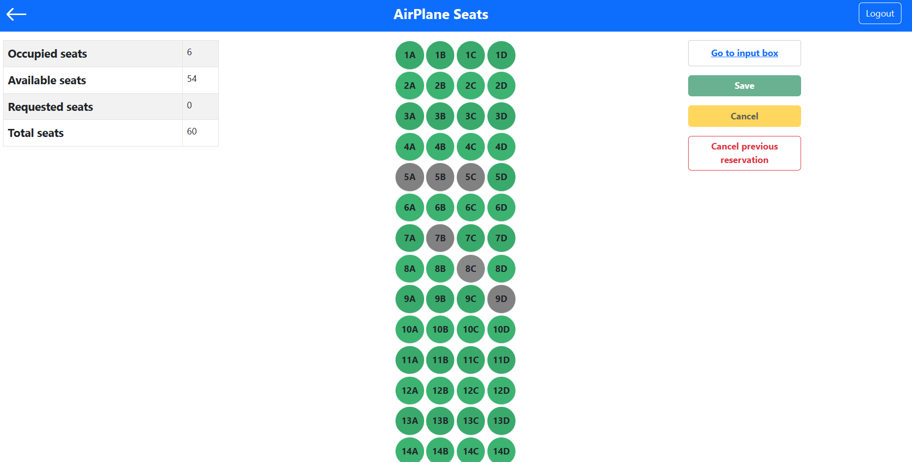

[](https://classroom.github.com/a/TsciYmrA)
# Exam #2: "Airplane Seats"
## Student: s309482 Santoro Francesco 

## React Client Application Routes

- Route `/`: main page, here it's possible to select a plane among the three available types, this page is visible both on authenticathed and unauthenticated view.
- Route `/plane/:type`: this page is slightly different on authenticathed and unauthenticated view:
in the unauthenticated view on the left the number of occupied seats, available seats, and the total number of seats are shown (in the authenticated one there's also the number of requested seats); in the center there is the grid representing all the seats, where each seat has its own code and status (grey if occupied, green if available, orange if requested but only in the authenticated view), on the right there's a button inviting the user to log-in to make reservations; while in the authenticated view there are four buttons to handle the reservations.
- Route `/plane/:type/automatic`: in the center there is a input box to insert the desired number of seats; otherwise is similar as the previous route. 
- Route `/login`: login page
- Route `*`: for the pages that do not exist

## API Server

- GET `/api/plane`
  - description: retrieves information about all planes: type, number of rows and number of seats
  - request parameters and request body content: _None_
  - response: `200 OK` (success)
  - response body content: an array of objects, where each object represent a plane and the information about the number of its rows and seats

  ``` json
  [
    {
      "type": "local",
      "rowNumber": 15,
      "seatNumber": 4
    },
    ...
  ]
  ```
  - error responses: `500 Internal Server Error` (generic error); `422 Unprocessable entity` (validation error) 

  - GET `/api/plane/:type`
    - description: retrieves the list of all seats belonging to the specified plane type
    - request parameters: type representing the plane type
    - request body content: _None_
    - response: `200 OK` (success)
    - response body content: an array of objects, where each object represents a single seat, with its own information, of the specified plane type
     
    ``` json
    [
      {
        "rowId": 1,
        "userEmail": "francesco@polito.it",
        "row": 1,
        "seat": "A",
        "type": "local"
      },
      {
        "rowId": 2,
        "userEmail": null,
        "row": 1,
        "seat": "B",
        "type": "local"
      },
      ...
    ]
    ```
  - error responses: `500 Internal Server Error` (generic error); `422 Unprocessable entity` (validation error); `404 Not Found` (plane type not found)

- GET `/api/plane/:type/getAvailability` 
  - description: retrieves the availability of the specified plane type's seats
  - request parameters: type representing the plane type
  - request body content: _None_
  - response: `200 OK` (success)
  - response body content: an object containing the number of occupied seats, available seats, and the total number of seats
  ``` json
    {
      "available": 50,
      "occupied": 10,
      "total": 60
    }
  ```
  - error responses: `500 Internal Server Error` (generic error); `422 Unprocessable entity` (validation error)
  
- PATCH `/api/plane/:type/addReservationByGrid`
  - description: creates a reservation, by providing all the relevant information, through an array of reservation
  - request parameters: type representing the plane type
  - request body content: reservation array containing an object for each requested seat [{row, seat},] return the rowId
  ``` json
    [
      {
        "row": 1,
        "seat": "A"
      },
      {
        "row": 2,
        "seat": "C"
      },
      ...
    ]
  ```
  - response: `200 OK` (success)
  - reponse body content: an array of numbers, where each number represents the rowId of the reserved seat
  ``` json
    [
      1, 2, 4, ...
    ]
  ```
  - response: `207 Multi-Status` (the user sent right information but some or all the selected seats have been already occupied in the mean time)
  - response body content: an error message explaining what happened and an array with all the seats having caused the conflict
  ```json
    {
      "message": "the seats highlighted in red are already occupied",
      "occupiedSeats": [{
        "rowId": 177,
        "row": 3,
        "seat": "E"
      },
      {
        "rowId": 178,
        "row": 3,
        "seat": "F"
      },
      ...
      ]
    }
  ```
  - error responses: `500 Internal Server Error` (generic error); `422 Unprocessable entity` (validation error or user already having a reservation on the specified plane type); `404 Not Found` (requested seat not found)

  - PATCH `/api/plane/:type/addReservationByNumber`
    - description: creates a reservation, by providing all the relevant information, through the number of the requested seats
    - request parameters: type representing the plane type
    - request body content: the number of desidered seats
    - response: `200 OK` (success)
    - response body content: an array of numbers, where each number represents the rowId of the reserved seat

    ``` json
      [
        1, 2, 4, ...
      ]
    ```

    - error responses: `500 Internal Server Error` (generic error); `422 Unprocessable entity` (validation error or user already having a reservation on the specified plane type or if there are not enough seats to satisfy the request);  `404 Not Found` (requested seat not found)

  - PATCH `/api/plane/:type/deleteReservation`
    - description: deletes a reservation, by providing all the relevant information
    - request parameters: type representing the plane type
    - request body content: _None_
    - response: `200 OK` (success)
    - response body content: an empty array
    - error responses: `500 Internal Server Error` (generic error); `422 Unprocessable entity` (validation error); `404 Not Found` (reservation not found)


## Database Tables

- Table `plane` - contains rowId, userEmail, row, seat, type 
- Table `planeInfo` - contains type, rowNumber, seatNumber
- Table `user` - contains id, email, hash, salt

## Main React Components

- `MainLayout` (in `PageLayout.jsx`): shows the three type of planes with their name and an icon, by clicking on them the user is redirect to `/plane/:type`.
- `StatusLayout` (in `PageLayout.jsx`): a table showing the number of occupied seats, available seats, and the total number of seat; in the authenticated view there is the number of requested seats as well; this table occupies just 1/3 of the page; the second 1/3 is addressed by an Outlet component (here the user can make the reservation by grid or by inserting a number); the last 1/3 is occupied by the Buttons component.
- `GridLayout` (in `PageLayout.jsx`): the grid for the seats, which is represented by the Grid component. The logic for retrieving the seats' information from the database is implemented here.
- `InputLayout` (in `PageLayout.jsx`): the input box to insert the desidered number of seats to make a reservation.
- `Buttons` (in `Buttons.jsx`): the four buttons to handle the creation/cancellation of a reservation; the buttons behave a little differently whether the user is on the route `/plane/:type` or `/plane/:type/automatic`.
- `Grid` (in `Grid.jsx`): here the logic of the grid is handled; the user can only click (in the authenticated view) on the available seats which immediately become requested and vice-versa. Any conflict is handled here.
- `MyTable` (in `Grid.jsx`): the actual grid, here there is also the function to handle the click of any seats.
- `LoginForm` (in `Auth.jsx`): form to perform the login.
- `MessageContext.Provider` (in `messageCtx.js`): context containing the handling of the function.
- `OccupancyContext.Provider` (in `messageCtx.js`): context containing all the states needed for the number of occupied seats, available seats, requested seats and the total number of seats.
- `ReservationContext.Provider` (in `messageCtx.js`): context containing all the states needed for handling the creation/cancellation of any reservation and managing any conflict.

## Screenshot


## Users Credentials

- username: francesco@polito.it password: password1
- username: marco@polito.it password: password2
- username: luca@polito.it password: password3
- username: antonio@polito.it password: password4
